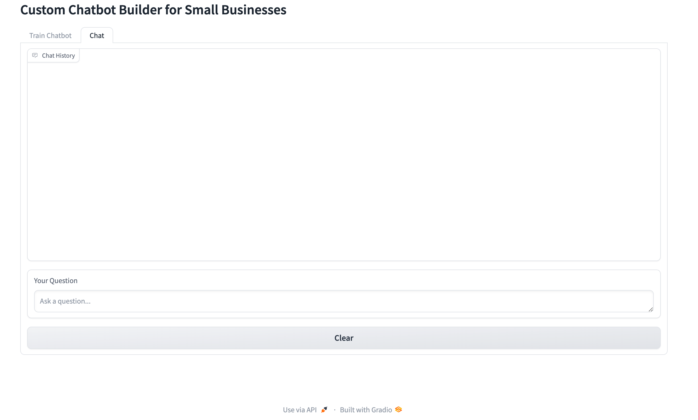

# Custom Chatbot Builder for Small Businesses

<div align="center">


-lightgrey)

</div>

A professional chatbot builder that allows small businesses to create custom AI chatbots using their FAQs and business information. Optimized for Apple Silicon (M1) Macs.

## ✨ Features

- 🤖 Easy-to-use interface for inputting business details and FAQs
- 🧠 Automatic chatbot training using state-of-the-art NLP models
- ⚡️ Optimized performance using Apple M1's MPS backend
- 📤 Export functionality for integration with various platforms
- 📝 Comprehensive logging and error handling
- 🏗️ Professional, modular codebase

## 🖼️ Screenshots

<div align="center">
  
  <p><em>Chat Interface - Interact with your trained chatbot</em></p>
  
  
  <p><em>Training Interface - Configure and train your chatbot</em></p>
</div>

## 🚀 Installation

1. Clone the repository:
   ```bash
   git clone https://github.com/yourusername/custom-chatbot-builder.git
   cd custom-chatbot-builder
   ```

2. Create a virtual environment:
   ```bash
   python -m venv venv
   source venv/bin/activate  # On macOS
   ```

3. Install dependencies:
   ```bash
   pip install -r requirements.txt
   ```

## 📁 Project Structure

<div align="center">
  <pre>
  <code>
📦 <b>Custom_Chatbot_Builder</b>
 ┣ 📂 <b>assets</b>
 ┃ ┣ 🖼️ chat_interface.png
 ┃ ┗ 🖼️ training_interface.png
 ┣ 📂 <b>src</b>
 ┃ ┗ 📂 <b>chatbot</b>
 ┃   ┣ 📂 <b>api</b>          ⚡️ REST API endpoints
 ┃   ┣ 📂 <b>config</b>       ⚙️ Configuration files
 ┃   ┣ 📂 <b>data</b>         🔄 Data processing modules
 ┃   ┗ 📂 <b>models</b>       🧠 ML model training & inference
 ┣ 📂 <b>data</b>
 ┃ ┗ 📄 chatbot_export.json   💾 Training data & exports
 ┣ 📄 requirements.txt        📦 Project dependencies
 ┗ 📄 README.md              📚 Documentation
  </code>
  </pre>
</div>

<div align="center">
  <table>
    <tr>
      <td align="center">📂 <code>api/</code></td>
      <td>RESTful API endpoints for chatbot interaction</td>
    </tr>
    <tr>
      <td align="center">📂 <code>config/</code></td>
      <td>Configuration settings and environment variables</td>
    </tr>
    <tr>
      <td align="center">📂 <code>data/</code></td>
      <td>Data processing, validation, and transformation</td>
    </tr>
    <tr>
      <td align="center">📂 <code>models/</code></td>
      <td>ML models for NLP and chatbot training</td>
    </tr>
  </table>
</div>

## 💻 Usage

1. Start the Gradio interface:
   ```bash
   python src/chatbot/api/app.py
   ```

2. Open your browser and navigate to the displayed URL
3. Input your business details and FAQs
4. Train and test your custom chatbot
5. Export the chatbot configuration for integration

## 🛠️ Development

```bash
# Run tests
pytest tests/

# Format code
black src/ tests/

# Sort imports
isort src/ tests/

# Lint code
flake8 src/ tests/
```

## 📝 License

This project is licensed under the MIT License - see the [LICENSE](LICENSE) file for details.

## 🤝 Contributing

Contributions, issues, and feature requests are welcome! Feel free to check [issues page](https://github.com/yourusername/custom-chatbot-builder/issues).

## ⭐️ Show your support

Give a ⭐️ if this project helped you!
