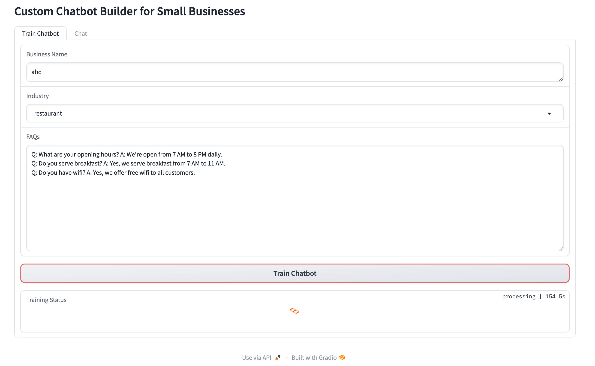

# Custom Chatbot Builder for Small Businesses

<div align="center">


-lightgrey)

</div>

A professional chatbot builder that allows small businesses to create custom AI chatbots using their FAQs and business information. Optimized for Apple Silicon (M1) Macs.

## ✨ Features

- 🤖 Easy-to-use interface for inputting business details and FAQs
- 🧠 Automatic chatbot training using state-of-the-art NLP models
- ⚡️ Optimized performance using Apple M1's MPS backend
- 📤 Export functionality for integration with various platforms
- 📝 Comprehensive logging and error handling
- 🏗️ Professional, modular codebase

## 🖼️ Screenshots

<div align="center">
  
  <p><em>Chat Interface - Interact with your trained chatbot</em></p>
  
  
  <p><em>Training Interface - Configure and train your chatbot</em></p>
</div>

## 🚀 Installation

1. Clone the repository:
   ```bash
   git clone https://github.com/yourusername/custom-chatbot-builder.git
   cd custom-chatbot-builder
   ```

2. Create a virtual environment:
   ```bash
   python -m venv venv
   source venv/bin/activate  # On macOS
   ```

3. Install dependencies:
   ```bash
   pip install -r requirements.txt
   ```

## 📁 Project Structure

Custom_Chatbot_Builder_for_Small_Businesses/
├── assets/                    # Screenshots and images
│   ├── chat_interface.png
│   └── training_interface.png
├── src/                      # Source code
│   └── chatbot/
│       ├── api/             # API endpoints
│       ├── config/          # Configuration files
│       ├── data/           # Data processing modules
│       └── models/         # ML model training and inference
├── data/                    # Training data and exports
│   └── chatbot_export.json
├── requirements.txt         # Project dependencies
└── README.md               # Project documentation

## 💻 Usage

1. Start the Gradio interface:
   ```bash
   python src/chatbot/api/app.py
   ```

2. Open your browser and navigate to the displayed URL
3. Input your business details and FAQs
4. Train and test your custom chatbot
5. Export the chatbot configuration for integration

## 🛠️ Development

```bash
# Run tests
pytest tests/

# Format code
black src/ tests/

# Sort imports
isort src/ tests/

# Lint code
flake8 src/ tests/
```

## 📝 License

This project is licensed under the MIT License - see the [LICENSE](LICENSE) file for details.

## 🤝 Contributing

Contributions, issues, and feature requests are welcome! Feel free to check [issues page](https://github.com/yourusername/custom-chatbot-builder/issues).

## ⭐️ Show your support

Give a ⭐️ if this project helped you!
